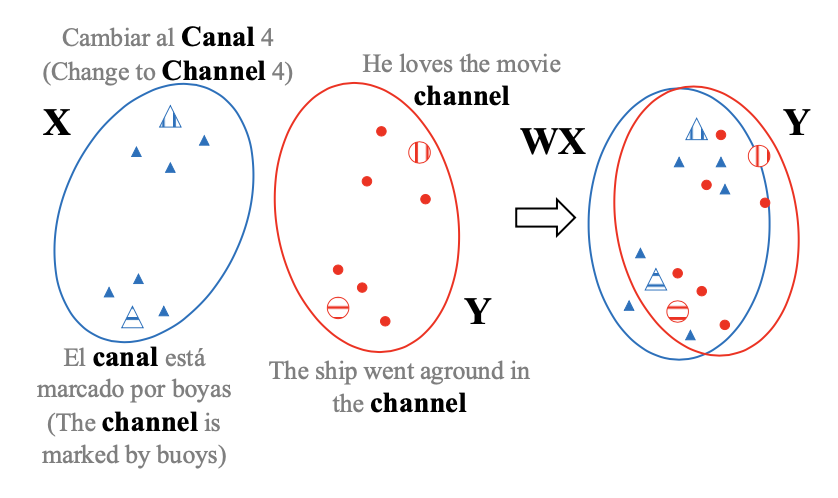
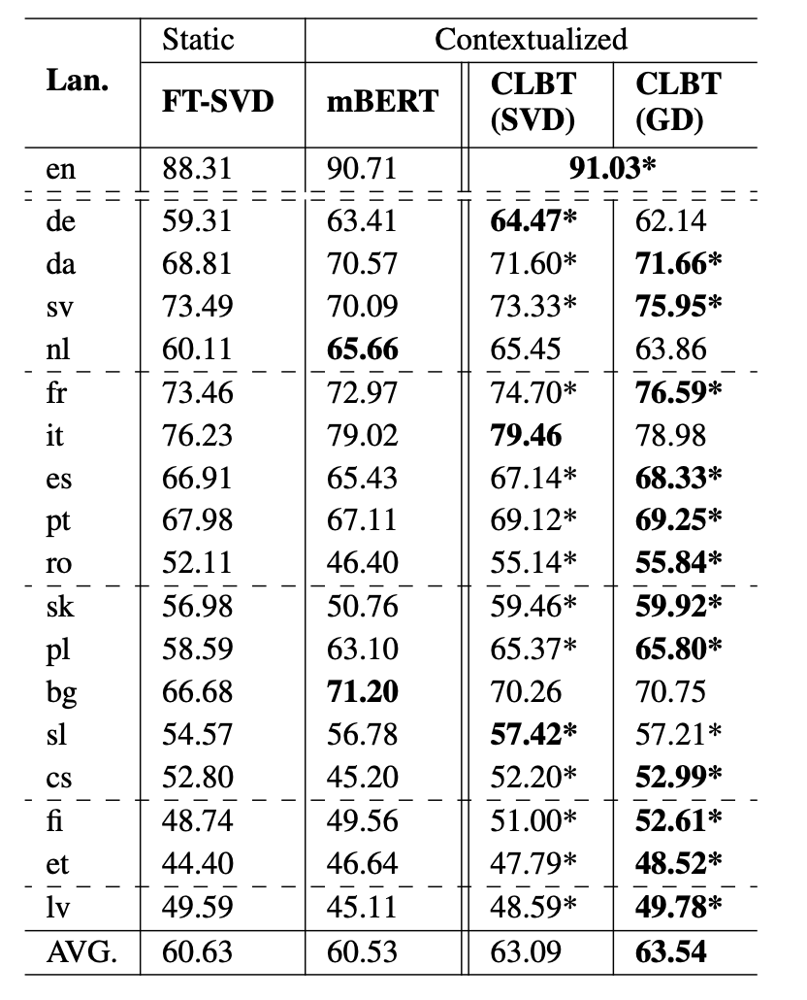
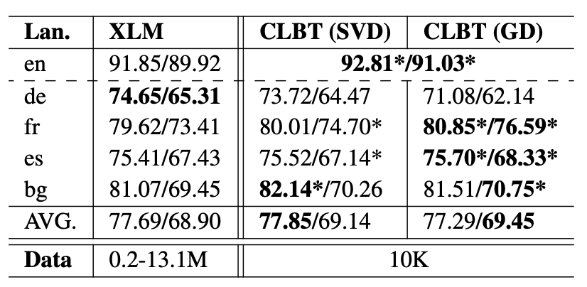
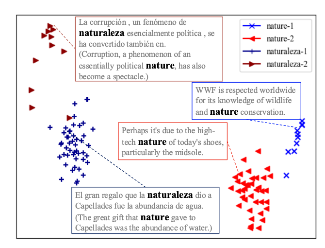
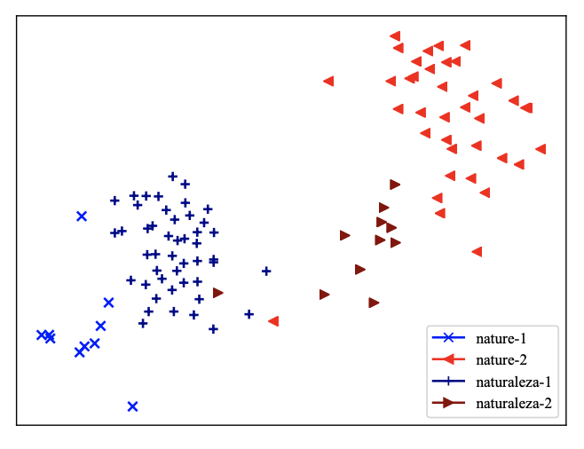
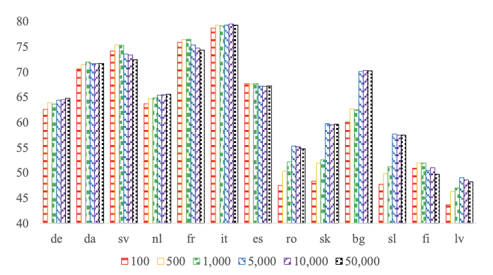

這篇 paper 在探討 contextual space 中 cross-lingual 的 representations ，提出了 CLBT (Cross-Lingual BERT Transformation)，可以從 pre-trained BERT 中產生跨語言的 contextualized word embeddings，並且能產生不同語言間的 linear transformation。

不同語言的 word embeddings 被投影在 shared semantic space 上經過 linear transformation 的結果。

# Cross-Lingual BERT Transformation

傳統的 static cross-lingual word embeddings 是需要在配對好的 type-level data (dictionaries) 上進行 supervised 的 training，而 contextualized cross-lingual word embeddings 則是使用 word token-level data。

## Off-Line Transformation

Off-Line transformation 的方法是將不同語言各自 pre-trained 的 word embeddings 投影或是轉換到一個 shared semantic space 上的方式。在這篇 paper 中，作者將 targe language 的 embeddings (Y)投影到 source language (X)的 space 上，投影的方式為 Linear Transformation ，目標是要找出一個 W:

$$\min_{W} \sum_{i=1}^{n} ||Wx_i-y_i||^2$$

使用的方式有兩種：

1. Singular Value Decomposition (SVD)

    利用 SVD 可以得到一組 analytical solution，解法是：

    $$W = VU^T,\quad where\quad U \Sigma V^T = SVD(Y^TX)$$

    其中

    $$X \in R^{n\times d} \quad and \quad Y \in R^{n\times d}$$

    n 代表 contextualized embeddings 的數量，d 是一個 embedding 的 dimension

    使用這個方式求出來的 W 會是一個 orthogonal matrix。

2. Gradient Decent (GD)

    當 training data 增加時（很大的 n ），SVD 的方式會佔據大量的 memory 還有 time，因此可以採用 approximate solution，也就是用 gradient decent 的方式去算一個 W。

# Experiments

這篇 paper 使用的是 Europarl corpora 的 dataset，並且使用 fast_align 去做 alignment，我猜測是對 word-level 做 alignment。 每個 language 都抽出 10,000 句來進行實驗，由 English 做為 Source Language 並且由另外 17 種歐洲語言做為 Target Language

## Result

## Analysis

t-SNE visualization

經過 transformation 之後，不同語言、相同語意的字會被投影到比較靠近的位置。

### Effect of training data size

隨著句子數量的增加，表現不一定會比較好，大部分的語言是在 5000 句左右達到最好的效果；另外在比較靠近英文的語言，例如 de, da, es，只要 100 句就可以達到非常好的效果。